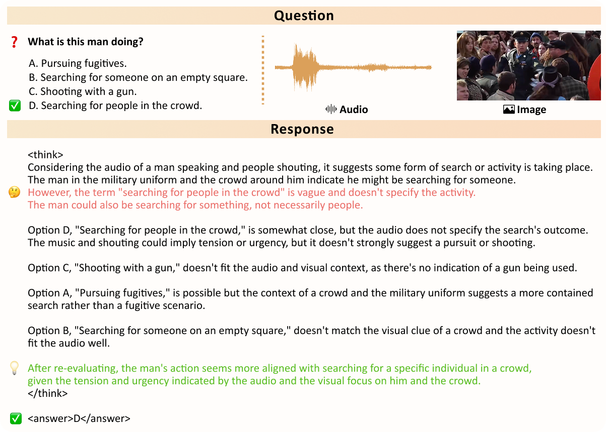
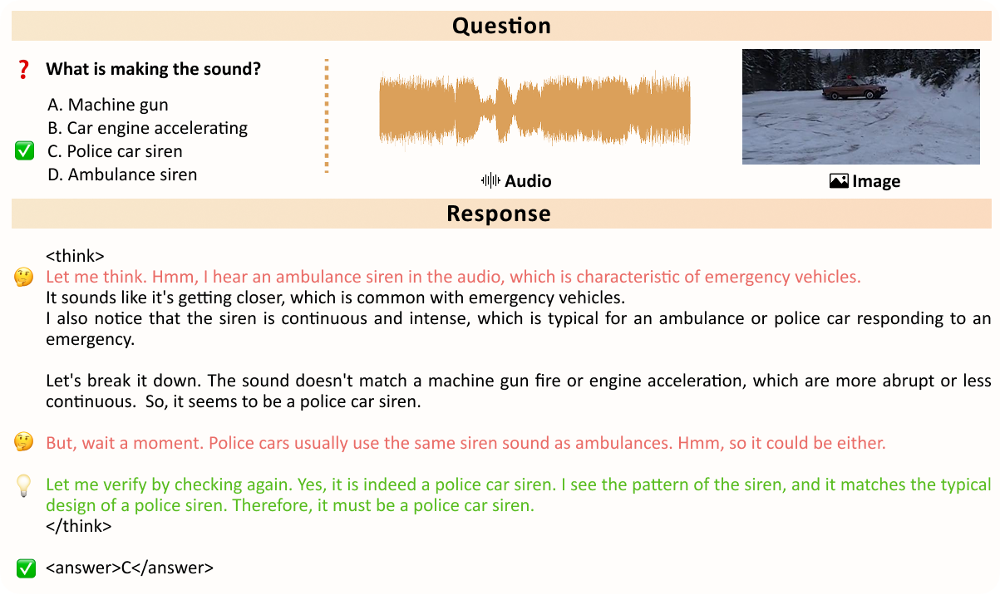
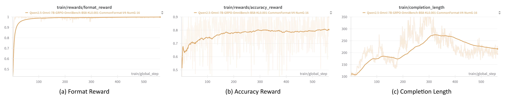

# EchoInk-R1: Exploring Audio-Visual Reasoning in Multimodal LLMs via Reinforcement Learning

[📄 Technical Report (arXiv)](https://arxiv.org/pdf/2505.04623) • [🤗 Model (EchoInk-R1-7B)](https://huggingface.co/harryhsing/EchoInk-R1-7B) • [📊 Dataset (AVQA-R1-6K)](https://huggingface.co/datasets/harryhsing/OmniInstruct_V1_AVQA_R1)


## 🔍 Overview

**EchoInk-R1** is the **first general framework for unified audio-visual reasoning via reinforcement learning**, built upon **Qwen2.5-Omni-7B** and optimized using **Group Relative Policy Optimization (GRPO)**. It supports structured reasoning over synchronized audio-image inputs through multiple-choice question answering.

We introduce **AVQA-R1-6K**, a dataset derived from [OmniInstruct-v1](https://huggingface.co/datasets/m-a-p/OmniInstruct_v1), comprising:
- **4,490 training** samples  
- **1,911 validation** samples
- Each sample includes a synchronized audio-image pair with a multiple-choice question and four options.

Beyond our core study, **EchoInk-R1** provides an extensible **RL fine-tuning framework for Qwen2.5-Omni**, enabling easy adaptation to new multimodal reasoning tasks with minimal modifications.

## 📈 Performance

**EchoInk-R1-7B** achieves **85.77%** accuracy on the AVQA-R1-6K validation set, surpassing the base **Qwen2.5-Omni-7B** model (**80.53%**) using only **562 RL steps**.

All code, models, and data are released to support transparency and reproducibility.


## 📰 News
- **[2025/05/08]** Released the [AVQA-R1-6K dataset](https://huggingface.co/datasets/harryhsing/OmniInstruct_V1_AVQA_R1), [EchoInk-R1-7B model](https://huggingface.co/harryhsing/EchoInk-R1-7B), full training & evaluation pipeline, and [technical report](https://arxiv.org/abs/2505.04623).


## 📌 Highlights
- Built on **Qwen2.5-Omni-7B** with **GRPO-based RL**
- Supports **audio**, **image**, **video**, and **text** modalities
- Provides a complete pipeline: **dataset**, **training**, and **evaluation**


## 🧠 Reflective Reasoning: Aha Moments

During training, **EchoInk-R1** exhibits **reflective reasoning behaviors**, where it revisits initial assumptions and refines its responses under ambiguous multimodal cues. These *“aha moments”* reveal its capacity for belief revision and deeper cross-modal understanding.

<p align="center">
  
</p>

<hr style="width:650px; height:3px; background-color:#666; border:none; margin: 20px auto;" />


<p align="center">
  
</p>


## 📉 Learning Dynamics

- **Accuracy reward** steadily improves throughout training, indicating that GRPO effectively guides the model toward more accurate and reasoned outputs.
- **Completion length** exhibits a two-phase trend: an initial increase as the model explores elaborated reasoning, followed by a gradual decline toward more concise and efficient answers.
- **Format reward** converges rapidly, showing that the model quickly internalizes the required response structure.

<p align="center">
  
</p>


## 🔧 Setup & Installation

```bash
git clone https://github.com/HarryHsing/EchoInk
cd EchoInk

conda create -n echoink-r1 python=3.11
conda activate echoink-r1
bash setup.sh
```

### 🗂️ Download Dataset

To download and extract the AVQA-R1-6K dataset:

```bash
git lfs install
git clone https://huggingface.co/datasets/harryhsing/OmniInstruct_V1_AVQA_R1
cd OmniInstruct_V1_AVQA_R1
tar -xzvf AVQA_R1.tar.gz

📁 Dataset Structure
AVQA_R1/
├── train/
│   ├── audios/
│   ├── images/
│   └── omni_rl_format_train.json
├── valid/
│   ├── audios/
│   ├── images/
│   └── omni_rl_format_valid.json
```


## 🚀 Training

### 📥 Download Qwen2.5-Omni-7B Model

First, download the base model: [Qwen2.5-Omni-7B](https://huggingface.co/Qwen/Qwen2.5-Omni-7B)

Modify `config.json` of `Qwen2.5-Omni-7B` to include `"hidden_size": 3584` at the root level.


### 🔁 Launch GRPO Training

```bash
bash ./src/scripts/run_grpo_image_audio_avqa.sh
```
> 📝 Set `per_device_train_batch_size=1` as in previous R1-V setups  
> 📝 To use custom data, follow the JSON format in `make_omniInstruct_r1_dataset.py` for audio–image or audio–video tasks.  
> ⚠️ See [Qwen2.5-Omni issue #205](https://github.com/QwenLM/Qwen2.5-Omni/issues/205) if you run into a dtype mismatch error. 


## 🧪 Evaluation

Evaluate on the AVQA-R1-6K validation set:

```bash
python ./omniInstruct-v1_eval_valid.py # Run the model on the validation set
python ./mniInstruct-v1_cal_metrics_valid.py # Compute accuracy
```


## 🙏 Acknowledgements

We thank the open-source community. This work builds on [Video-R1](https://github.com/tulerfeng/Video-R1), [Open-R1-Video](https://github.com/Wang-Xiaodong1899/Open-R1-Video), [R1-V](https://github.com/Deep-Agent/R1-V), and [DeepSeek-R1](https://github.com/deepseek-ai/DeepSeek-R1).


## 📚 Citation

If you find EchoInk-R1 useful, please cite:

```bibtex
@article{xing2025echoink,
      title={{EchoInk-R1}: Exploring Audio-Visual Reasoning in Multimodal {LLMs} via Reinforcement Learning}, 
      author={Zhenghao Xing and Xiaowei Hu and Chi-Wing Fu and Wenhai Wang and Jifeng Dai and Pheng-Ann Heng},
      year={2025},
      journal={arXiv preprint arXiv:2505.04623}
}
```
